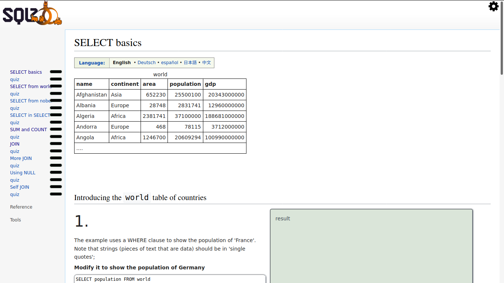

## Project: SQL Zoo

SQL Zoo is one of the few resources online that actually lets you build and run queries against existing tables. Each tutorial will show you a table and then have you run queries against it to answer specific questions. Some of the queries, particularly at first, are quite simple. They definitely get 
more challenging towards the end and can be real head scratchers.

## On your Computer

- This project contains all questions and answers to them from 
  [SQL ZOO Tutorial](https://sqlzoo.net/wiki/SELECT_from_WORLD_Tutorial)

To get a local copy up and running follow these simple example steps.

### Prerequisites

- Any PC or device with an internet connection and ability to use the command
  line terminal

### Setup

- Open the command line terminal

### Install

- Go to your preferred directory
- Run `git clone https://github.com/TSHEPO-CLOUD/Rubylinters/tree/feature` command

## Built with

- SQL

## Author

👤 **TSHEPO DAVID MOLEFE**

- GitHub: [@githubhandle](https://github.com/TSHEPO-CLOUD)
- Twitter: [@twitterhandle](https://twitter.com/tshepomolefem)
- LinkedIn: [LinkedIn](https://www.linkedin.com/in/tshepo-molefe-8153313b)

## 🤝 Contributing

Contributions, issues, and feature requests are welcome!

## Show your support

Give a ⭐️ if you like this project!

## Acknowledgments

- The Odin Project
- DATABASE

## 📝 License

This project is [MIT License](./LICENSE) licensed.